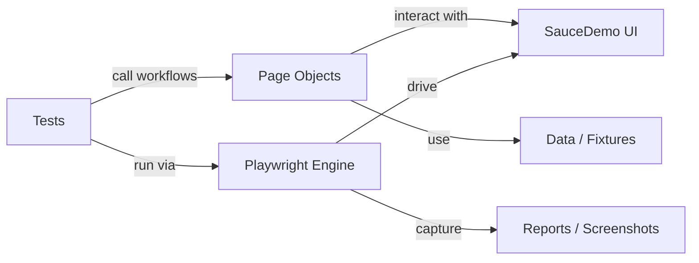

# Enterprise Playwright TypeScript Automation Framework 🚀

An enterprise-ready, cloud-isolated End-to-End (E2E) testing framework engineered to validate complex data-driven transactional flows, eliminate pipeline flakiness, and optimize CI/CD execution overhead. 

---

## 📉 Core Business & Operational Impact
*   **Reduced Execution Costs**: Utilizes stateless execution contexts to scale 24 parallel cross-browser threads without causing runner resource bloat or memory leaks.
*   **Protected Revenue Paths**: Automates complex financial calculations (subtotal logic, variable tax percentages) within deployment pipelines to safeguard digital checkout systems.
*   **Zero-Maintenance Design**: Employs structural Strategy Patterns for multi-conditional UI states, completely eliminating brittle code maintenance.

---

## 🏗️ Architectural Highlights & Design Patterns

### 1. Page Object Model (POM)
The framework strictly isolates page structural elements from test script assertions. Every interface layout (`LoginPage`, `InventoryPage`, `CartPage`, `CheckoutPage`) is modeled as a dedicated TypeScript class containing strictly typed locators and atomic action workflows.

### 2. Strategy & Functional Loop Patterns (Data-Driven Matrix)
Rather than relying on brittle, slow conditional statements (`if/else`), the inventory sorting module implements a functional data-driven strategy pattern. The matrix dynamically streams async selectors, regular expression string manipulation blocks, and abstract mathematical sorting routines to validate all 4 distinct UI permutations concurrently.

### 3. Isolated State Execution (Stateless Automation)
Every test scenario operates under complete context isolation with zero test cross-contamination or script dependencies. This allows the execution engine to run tests fully in parallel across multiple threads safely.

---

## � Architecture Overview



- Tests describe user journeys and delegate UI actions to page objects.
- Page objects encapsulate locators, assertions, and reusable workflows.
- Playwright executes the steps in the browser and returns results for assertions and reporting.
- Data and fixtures feed test inputs while reports preserve execution evidence.

---

## �🧬 Advanced Engineering & Data Transformation

To avoid flaky, slow test runs, this framework handles dynamic currency transformations and concurrent calculations using optimized algorithms directly within the validation stream:

```typescript
// Architectural abstraction used to isolate and sanitize billing calculations
const numericPrice = parseFloat(priceText.replace(/[^0-9.]+/g, ""));
```

This strategy abstracts the mathematical verification of shopping cart subtotals and dynamic regional tax invoices, ensuring 100% calculation accuracy across staging and production environments.

---

## 🧪 Automated Test Coverage Summary

*   **Authentication Matrix**: Verification of happy-path standard sessions, structural form validations, and explicit error state traps for locked-out user gates.
*   **Data-Driven Inventory Engine**: Mathematical validation verifying numerical sorting calculations (`Price: Low to High / High to Low`) and localized string collation comparisons (`Name: A to Z / Z to A`).
*   **Revenue Path & State Persistence**: Validates real-time shopping cart badge increments and multi-page data retention validation.
*   **Financial Validation Gateway**: Extracts item subtotal wrappers, performs runtime percentage tax computations, and asserts absolute mathematical invoice calculation accuracy.

---

## 🛠️ Tech Stack & Dependencies

*   **Core Engine**: Playwright (Latest Enterprise Release)
*   **Language**: TypeScript (Strict Type Safety)
*   **Test Runner**: Playwright Test Runner
*   **CI/CD Platform**: GitHub Actions (Ubuntu-latest runner)
*   **Target Browsers**: Chromium, Mozilla Firefox, WebKit (Apple Safari)

---

## 🚀 Execution & Local Verification

### Prerequisites
Ensure you have [Node.js](https://nodejs.org) installed on your machine.

### Installation
```bash
# Clone the repository
git clone https://github.com

# Move inside the project workspace
cd playwright-ts-core-framework

# Install project packages directly
npm install
```

### Running Tests Locally
```bash
# Run tests headlessly across all configured browsers
npx playwright test

# Launch the interactive GUI Desktop Testing Dashboard
npx playwright test --ui
```

---

## 🤖 DevOps & CI/CD Pipeline
This framework features an automated deployment execution workflow inside **GitHub Actions**. Upon any source branch `push` event, a cloud virtual machine automatically provisions a headless Linux platform to trigger **24 cross-browser evaluation runs simultaneously** across Chromium, Firefox, and Safari engines, acting as an automated corporate quality gate.
